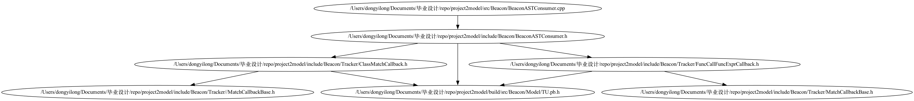
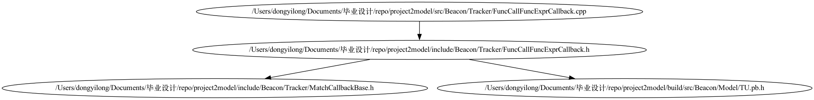
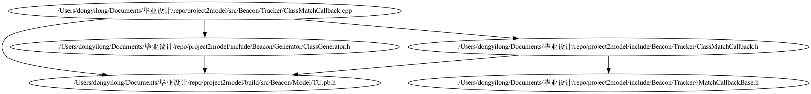
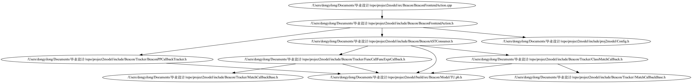
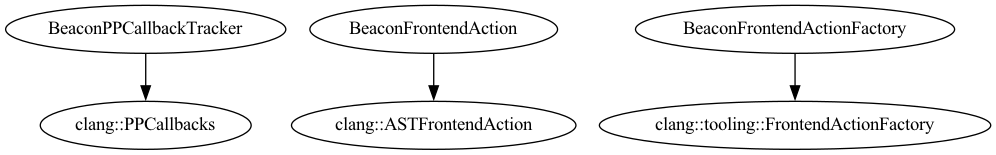
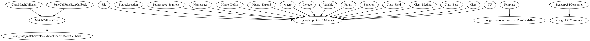
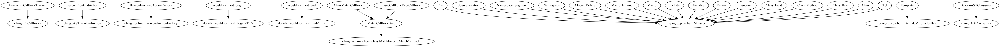

<!-- START doctoc generated TOC please keep comment here to allow auto update -->
<!-- DON'T EDIT THIS SECTION, INSTEAD RE-RUN doctoc TO UPDATE -->
**Table of Contents**  *generated with [DocToc](https://github.com/thlorenz/doctoc)*

- [proj2model](#proj2model)
  - [介绍](#%E4%BB%8B%E7%BB%8D)
  - [目标](#%E7%9B%AE%E6%A0%87)
  - [编译与使用](#%E7%BC%96%E8%AF%91%E4%B8%8E%E4%BD%BF%E7%94%A8)
  - [效果展示](#%E6%95%88%E6%9E%9C%E5%B1%95%E7%A4%BA)
    - [include依赖图](#include%E4%BE%9D%E8%B5%96%E5%9B%BE)
      - [以编译单元为单位](#%E4%BB%A5%E7%BC%96%E8%AF%91%E5%8D%95%E5%85%83%E4%B8%BA%E5%8D%95%E4%BD%8D)
      - [合并结果](#%E5%90%88%E5%B9%B6%E7%BB%93%E6%9E%9C)
    - [类继承图](#%E7%B1%BB%E7%BB%A7%E6%89%BF%E5%9B%BE)
      - [以编译单元为单位](#%E4%BB%A5%E7%BC%96%E8%AF%91%E5%8D%95%E5%85%83%E4%B8%BA%E5%8D%95%E4%BD%8D-1)
      - [合并结果](#%E5%90%88%E5%B9%B6%E7%BB%93%E6%9E%9C-1)
    - [UML图](#uml%E5%9B%BE)
  - [脚本编写指南](#%E8%84%9A%E6%9C%AC%E7%BC%96%E5%86%99%E6%8C%87%E5%8D%97)
  - [libTooling的坑](#libtooling%E7%9A%84%E5%9D%91)

<!-- END doctoc generated TOC please keep comment here to allow auto update -->

# proj2model
## 介绍
基于libTooling，将一个C++源文件或者C++项目，以编译单元为单位，转为json分析模型的libTooling工具。

可以在分析模型基础上进行进一步的项目静态分析，免于直接处理AST，便于后续并行处理等等。

script目录下提供了一些分析这些模型数据的脚本例子，可以生成项目的include依赖图与类继承图等等

状态: 写完了include依赖图生成，类继承图生成。类图生成的脚本还没写，但是生成类图的数据已经有了。

## 目标

- 基于node.js和vue搭建写一个代码监控平台，在项目分析得到的json分析模型基础上开发分析插件。

- 部署在一个服务器上，定时clone关注的项目代码，在web页面进行分析交互与展示。

- 结合git，提供增量分析功能。

- 比较不同版本的代码结构，类间耦合，模块化情况。在合流代码时自动拦截低质量代码，警示糟糕的代码设计。

## 编译与使用
```shell
# 安装llvm 16.0.0
# 可以参考官方教程，这里就不写了

# 编译项目
cmake -S . -B build
cmake --build build

# 运行项目，自己分析自己
cd build
# 这个conf文件里的东西可以自己改，默认是分析这个项目自身。具体怎么改可以参考源码，目前还没有文档。
./bin/project2model --conf=./conf/proj2model-conf.json

# 利用分析结果，生成include图
cd ../script

# node前安好 shelljs, commander
node gen-graph --help
node gen-graph --json-dir ./data --output-dir ./result/graph --with-merge --types include base
```

## 效果展示

### include依赖图
#### 以编译单元为单位





#### 合并结果

### 类继承图
#### 以编译单元为单位



#### 合并结果


### UML图
虽然分析数据已经有了，但是生成UML图的js脚本还没写...

分析数据示例可见[data.json](asset/5815163906600373956.json)

## 脚本编写指南
使用js分析如下proto产生的json文件，可以参考script目录下的gen-graph.js脚本
json数据示例可见[data.json](asset/5815163906600373956.json)
```protobuf
syntax = "proto3";

package beacon.model;

message File {
  optional string name = 1;
  optional string git_commit_id = 2;
}

message SourceLocation {
  optional string file = 1;
  optional int32 line = 2;
  optional int32 column = 3;
  optional bool is_invalid = 4;
  optional bool is_file_id = 5;
}

message Namespace {
  message Segment {
    optional string name = 1;
    enum Type {
      NS_UNKNOWN = 0;
      NS_NORMAL = 1;
      NS_CLASSNAME = 2;
    };
    optional Type type = 2;
  }
  repeated Segment segment = 1;
}

message Macro {
  message Define {
    optional string name = 1;
  };
  message Expand {
    optional string content = 1;
  };
  optional SourceLocation source_location = 1; // 源码位置
  optional bool is_expand = 2;
  optional Define define = 3;
  optional Expand expand = 4;
}

message Include {
  optional File file = 1; // #include了什么文件
  optional bool is_angle_bracket = 2; // 是否在尖括号内
  optional SourceLocation source_location = 3; // #include所在源码位置
}

message Template {
  // 模板有点复杂，先不考虑
}

message Variable {
  optional string name = 1;
  optional string type = 2;
  optional Template template_ = 3;
}

message Param {
  optional Variable var = 1;
  optional string default_value = 2;
}

message Function {
  optional string name = 1;
  optional string return_type = 2;
  repeated Param param_list = 3;
  optional SourceLocation source_location = 4;
  optional bool is_static = 5;
  optional Template template_ = 6;
}

message Class {
  enum Access {
    AC_UNKNOWN = 0;
    AC_PUBLIC = 1;
    AC_PRIVATE = 2;
    AC_PROTECTED = 3;
  }

  message Field {
    optional Access access = 1;
    optional Variable var = 2;
  }

  message Method {
    optional string name = 1;
    optional string return_type = 2;
    repeated Param param_list = 3;
    optional Access access = 4;

    // 有时间搞成几个枚举
    optional bool is_virtual = 5;
    optional bool is_pure_virtual = 6;
    optional bool is_const = 7;
    optional bool is_default = 8;
    optional bool is_static = 9;
    optional bool is_implicit = 10;
    optional bool is_delete = 11;
    optional bool is_deprecated = 12;
  }

  message Base {
    optional string name = 1;
    optional Namespace namespace_ = 2;
    optional Access access = 3;
    optional bool is_virtual = 4;
    optional Template template_ = 5;
  }

  // 一般都用匿名struct，需要提取struct typedef 的名字
  optional string name = 1;
  optional Namespace namespace_ = 2;
  optional SourceLocation source_location = 3;
  repeated Field field_list = 4;
  repeated Method method_list = 5;
  repeated Base base_list = 6;
  optional Template template_ = 7;
  optional bool is_struct = 8;
}

message TU {
  optional File file = 1;
  repeated Macro macro_list = 2;
  repeated Include include_list = 3;
  repeated Class class_list = 4;
  repeated Variable var_list = 5;
  repeated Function func_list = 6;
}
```

json示例数据如下
```json
{
  "file": {
    "name": "/Users/dongyilong/Documents/毕业设计/repo/project2model/src/proj2model/Config.cpp"
  },
  "includeList": [
    {
      "file": {
        "name": "/Users/dongyilong/Documents/毕业设计/repo/project2model/include/proj2model/Config.h"
      },
      "isAngleBracket": false,
      "sourceLocation": {
        "file": "/Users/dongyilong/Documents/毕业设计/repo/project2model/src/proj2model/Config.cpp",
        "line": 4,
        "column": 1,
        "isInvalid": false,
        "isFileId": true
      }
    }
  ],
  "classList": [
    {
      "name": "begin_tag",
      "isStruct": true
    },
    {
      "name": "would_call_std_begin",
      "isStruct": true
    },
    {
      "name": "would_call_std_begin",
      "baseList": [
        {
          "name": "detail2::would_call_std_begin\u003cT...\u003e",
          "access": "AC_PUBLIC",
          "isVirtual": false
        }
      ],
      "isStruct": true
    },
    {
      "name": "end_tag",
      "isStruct": true
    },
    {
      "name": "would_call_std_end",
      "isStruct": true
    },
    {
      "name": "would_call_std_end",
      "baseList": [
        {
          "name": "detail2::would_call_std_end\u003cT...\u003e",
          "access": "AC_PUBLIC",
          "isVirtual": false
        }
      ],
      "isStruct": true
    },
    {
      "name": "hash",
      "methodList": [
        {
          "name": "operator()",
          "returnType": "std::size_t",
          "paramList": [
            {
              "var": {
                "name": "j",
                "type": "const nlohmann::basic_json\u003cObjectType, ArrayType, StringType, BooleanType, NumberIntegerType, NumberUnsignedType, NumberFloatType, AllocatorType, JSONSerializer, BinaryType\u003e &"
              }
            }
          ],
          "access": "AC_PUBLIC",
          "isVirtual": false,
          "isPureVirtual": false,
          "isConst": true,
          "isDefault": false,
          "isStatic": false,
          "isImplicit": false,
          "isDelete": false,
          "isDeprecated": false
        }
      ],
      "isStruct": true
    }
  ]
}
```

## libTooling的坑

[libtooling-cant-find-stddef-h-nor-other-headers](https://stackoverflow.com/questions/19642590/libtooling-cant-find-stddef-h-nor-other-headers)

[LibTooling.html](https://clang.llvm.org/docs/LibTooling.html)

[clangd/issues/1044](https://github.com/clangd/clangd/issues/1044)

[troubleshooting#cant-find-compiler-built-in-headers-stddefh-etc](https://clangd.llvm.org/troubleshooting#cant-find-compiler-built-in-headers-stddefh-etc)

查看如上后明白需要在二进制的相对路径(../lib/clang/16.0.0/include)要有对应文件。

要么把二进制挪过去，要么把include文件复制过来。