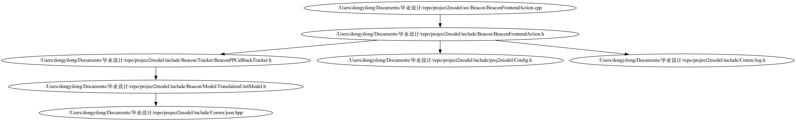
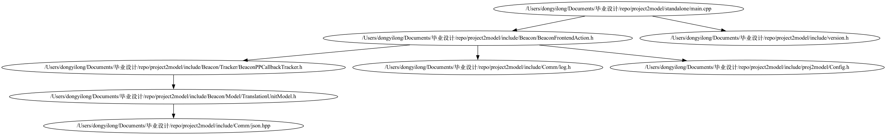
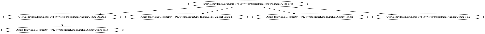
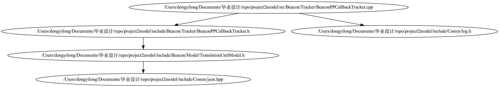
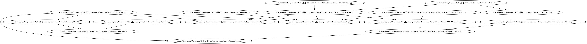

<!-- START doctoc generated TOC please keep comment here to allow auto update -->
<!-- DON'T EDIT THIS SECTION, INSTEAD RE-RUN doctoc TO UPDATE -->
**Table of Contents**  *generated with [DocToc](https://github.com/thlorenz/doctoc)*

- [proj2model](#proj2model)
  - [介绍](#%E4%BB%8B%E7%BB%8D)
  - [编译与使用](#%E7%BC%96%E8%AF%91%E4%B8%8E%E4%BD%BF%E7%94%A8)
  - [效果展示](#%E6%95%88%E6%9E%9C%E5%B1%95%E7%A4%BA)
    - [include依赖图](#include%E4%BE%9D%E8%B5%96%E5%9B%BE)
  - [libTooling的坑](#libtooling%E7%9A%84%E5%9D%91)

<!-- END doctoc generated TOC please keep comment here to allow auto update -->

# proj2model
## 介绍
基于libTooling，将一个C++源文件或者C++项目，以编译单元为单位，转为json(proto没写还)分析模型的libTooling工具。

可以在分析模型基础上进行进一步的项目静态分析，免于直接处理AST，便于后续并行处理等等。

script目录下提供了一些分析这些模型数据的脚本例子，可以生成项目的include依赖图与类图(类图写完了，但是还没加进来)等等


状态：在写了在写了（新建文件夹.gif）
状态: 写完了include依赖图生成，类图生成在另一个项目里，还没迁移orz
状态: 前端好难我不会写 :-(

## 编译与使用
```shell
# 安装llvm 16.0.0
# 可以参考官方教程，这里就不写了

# 编译项目
cmake -S . -B build
cmake --build build

# 运行项目，自己分析自己
cd build
./bin/project2model --conf=./conf/proj2model-conf.json

# 利用分析结果，生成include图
cd -
cd script
# node前安好 shelljs, commander
node gen-include-graph --json-dir ./data --output-dir ./result/includeGraph --with-merge
```

## 效果展示

### include依赖图







## libTooling的坑

https://stackoverflow.com/questions/19642590/libtooling-cant-find-stddef-h-nor-other-headers
https://clang.llvm.org/docs/LibTooling.html
https://github.com/clangd/clangd/issues/1044
https://clangd.llvm.org/troubleshooting#cant-find-compiler-built-in-headers-stddefh-etc

查看如上后明白需要在二进制的相对路径(../lib/clang/16.0.0/include)要有对应文件。

要么把二进制挪过去，要么把include文件复制过来。