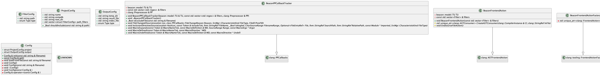
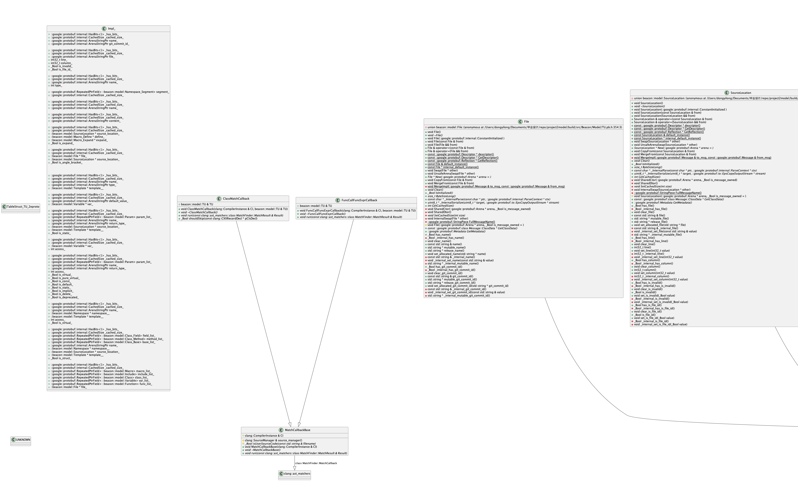

<!-- START doctoc generated TOC please keep comment here to allow auto update -->
<!-- DON'T EDIT THIS SECTION, INSTEAD RE-RUN doctoc TO UPDATE -->
**Table of Contents**  *generated with [DocToc](https://github.com/thlorenz/doctoc)*

- [proj2model](#proj2model)
  - [介绍](#%E4%BB%8B%E7%BB%8D)
  - [目标](#%E7%9B%AE%E6%A0%87)
  - [编译与使用](#%E7%BC%96%E8%AF%91%E4%B8%8E%E4%BD%BF%E7%94%A8)
  - [效果展示](#%E6%95%88%E6%9E%9C%E5%B1%95%E7%A4%BA)
    - [include依赖图](#include%E4%BE%9D%E8%B5%96%E5%9B%BE)
      - [以编译单元为单位](#%E4%BB%A5%E7%BC%96%E8%AF%91%E5%8D%95%E5%85%83%E4%B8%BA%E5%8D%95%E4%BD%8D)
      - [合并结果](#%E5%90%88%E5%B9%B6%E7%BB%93%E6%9E%9C)
    - [类继承图](#%E7%B1%BB%E7%BB%A7%E6%89%BF%E5%9B%BE)
      - [以编译单元为单位](#%E4%BB%A5%E7%BC%96%E8%AF%91%E5%8D%95%E5%85%83%E4%B8%BA%E5%8D%95%E4%BD%8D-1)
      - [合并结果](#%E5%90%88%E5%B9%B6%E7%BB%93%E6%9E%9C-1)
    - [UML图](#uml%E5%9B%BE)
      - [以编译单元为单位](#%E4%BB%A5%E7%BC%96%E8%AF%91%E5%8D%95%E5%85%83%E4%B8%BA%E5%8D%95%E4%BD%8D-2)
  - [脚本编写指南](#%E8%84%9A%E6%9C%AC%E7%BC%96%E5%86%99%E6%8C%87%E5%8D%97)
  - [libTooling的坑](#libtooling%E7%9A%84%E5%9D%91)

<!-- END doctoc generated TOC please keep comment here to allow auto update -->

# proj2model
## 介绍
基于libTooling，将一个C++源文件或者C++项目，以编译单元为单位，转为json分析模型的libTooling工具。

可以在分析模型基础上进行进一步的项目静态分析，免于直接处理AST，便于后续并行处理等等。

script目录下提供了一些分析这些模型数据的脚本例子，可以生成项目的include依赖图,类继承图,UML图等等

状态: 写完了include依赖图生成，类继承图生成。类图生成的脚本还没完全写，但是已经可以用了。

## 目标

- 基于node.js和vue搭建写一个代码监控平台，在项目分析得到的json分析模型基础上开发分析插件。

- 部署在一个服务器上，定时同步关注的项目代码，在web页面进行分析交互与展示。

- 结合git，提供增量分析功能。

- 比较不同版本的代码结构，类间耦合，模块化情况。在合流代码时自动拦截低质量代码，警示糟糕的代码设计。

## 编译与使用
```shell
# 安装llvm 16.0.0
# 可以参考官方教程，这里就不写了

# 编译项目
cmake -S . -B build
cmake --build build

# 运行项目，自己分析自己
cd build
# 这个conf文件里的东西可以自己改，默认是分析这个项目自身。具体怎么改可以参考源码，目前还没有文档。
./bin/project2model --conf=./conf/proj2model-conf.json

# 利用分析结果，生成include图
cd ../script

# node前安好 shelljs, commander
node gen-graph --help
node gen-graph --json-dir ./data --output-dir ./result/graph --with-merge --types include base

brew install plantuml

node gen-class --help
node gen-class --json-dir ./data --output-dir ./result/graph
```

## 效果展示

### include依赖图
#### 以编译单元为单位


#### 合并结果

### 类继承图
#### 以编译单元为单位


#### 合并结果


### UML图
gen-class是一个写了1/3的UML生成脚本。
脚本会分析TU.json生成如下的plantuml文件，然后调用plantuml生成图片。目前只展示了继承关系和主要类信息

```plantuml
@startuml
class BeaconPPCallbackTracker {
	{field} - beacon::model::TU & TU
	{field} - const std::vector<std::regex> & filters
	{field} - clang::Preprocessor & PP
	{method} + void BeaconPPCallbackTracker(beacon::model::TU & TU, const std::vector<std::regex> & filters, clang::Preprocessor & PP)
	{method} {abstract} + void ~BeaconPPCallbackTracker()
	{method} + _Bool isExcludeFile(const std::string & filename)
	{method} {abstract} + void FileChanged(SourceLocation Loc, class PPCallbacks::FileChangeReason Reason, SrcMgr::CharacteristicKind FileType, FileID PrevFID)
	{method} {abstract} + void InclusionDirective(SourceLocation HashLoc, const Token & IncludeTok, llvm::StringRef FileName, _Bool IsAngled, CharSourceRange FilenameRange, Optional<FileEntryRef> File, llvm::StringRef SearchPath, llvm::StringRef RelativePath, const Module * Imported, SrcMgr::CharacteristicKind FileType)
	{method} {abstract} + void MacroExpands(const Token & MacroNameTok, const MacroDefinition & MD, SourceRange Range, const MacroArgs * Args)
	{method} {abstract} + void MacroDefined(const Token & MacroNameTok, const MacroDirective * MD)
	{method} {abstract} + void MacroUndefined(const Token & MacroNameTok, const MacroDefinition & MD, const MacroDirective * Undef)
}
class FilterConfig {
	{field} + std::string path
	{field} + enum Type type
	
}
class ProjectConfig {
	{field} + std::string name
	{field} + std::string compdb
	{field} + std::string root_dir
	{field} + std::vector<struct FilterConfig> path_filters
	{method} + _Bool shouldInclude(const std::string & path)
}
class OutputConfig {
	{field} + std::string temp_dir
	{field} + std::string result_file
	{field} + std::string index_file
	{field} + enum Type type
	
}
class Config {
	{field} + struct ProjectConfig project
	{field} + struct OutputConfig output
	{method} {static} + Config & init(const std::string & filename)
	{method} {static} + const Config & get()
	{method} - void loadFromFile(const std::string & filename)
	{method} - void Config()
	{method} - void Config(const std::string & filename)
	{method} - void ~Config()
	{method} - void Config(const Config & )
	{method} - Config & operator=(const Config & )
}
class BeaconFrontendAction {
	{field} - beacon::model::TU TU
	{field} - const std::vector<Filter> & filters
	{method} + void BeaconFrontendAction(const std::vector<Filter> & filters)
	{method} {abstract} # std::unique_ptr<clang::ASTConsumer> CreateASTConsumer(clang::CompilerInstance & CI, clang::StringRef InFile)
	{method} {abstract} # void EndSourceFileAction()
}
class BeaconFrontendActionFactory {
	
	{method} {abstract} - std::unique_ptr<clang::FrontendAction> create()
}
class UNKNOWN {}
class UNKNOWN {}
BeaconPPCallbackTracker --|> clang::PPCallbacks
BeaconFrontendAction --|> clang::ASTFrontendAction
BeaconFrontendActionFactory --|> clang::tooling::FrontendActionFactory
@enduml
```

#### 以编译单元为单位



## 脚本编写指南
使用js分析如下proto产生的json文件，可以参考script目录下的gen-graph.js和gen-class.js脚本
json数据示例可见[data.json](asset/5815163906600373956.json)
json示例数据如下
```json
{
  "file": {
    "name": "/Users/dongyilong/Documents/毕业设计/repo/project2model/src/proj2model/Config.cpp"
  },
  "includeList": [
    {
      "file": {
        "name": "/Users/dongyilong/Documents/毕业设计/repo/project2model/include/proj2model/Config.h"
      },
      "isAngleBracket": false,
      "sourceLocation": {
        "file": "/Users/dongyilong/Documents/毕业设计/repo/project2model/src/proj2model/Config.cpp",
        "line": 4,
        "column": 1,
        "isInvalid": false,
        "isFileId": true
      }
    }
  ],
  "classList": [
    {
      "name": "begin_tag",
      "isStruct": true
    },
    {
      "name": "would_call_std_begin",
      "isStruct": true
    },
    {
      "name": "would_call_std_begin",
      "baseList": [
        {
          "name": "detail2::would_call_std_begin\u003cT...\u003e",
          "access": "AC_PUBLIC",
          "isVirtual": false
        }
      ],
      "isStruct": true
    },
    {
      "name": "end_tag",
      "isStruct": true
    },
    {
      "name": "would_call_std_end",
      "isStruct": true
    },
    {
      "name": "would_call_std_end",
      "baseList": [
        {
          "name": "detail2::would_call_std_end\u003cT...\u003e",
          "access": "AC_PUBLIC",
          "isVirtual": false
        }
      ],
      "isStruct": true
    },
    {
      "name": "hash",
      "methodList": [
        {
          "name": "operator()",
          "returnType": "std::size_t",
          "paramList": [
            {
              "var": {
                "name": "j",
                "type": "const nlohmann::basic_json\u003cObjectType, ArrayType, StringType, BooleanType, NumberIntegerType, NumberUnsignedType, NumberFloatType, AllocatorType, JSONSerializer, BinaryType\u003e &"
              }
            }
          ],
          "access": "AC_PUBLIC",
          "isVirtual": false,
          "isPureVirtual": false,
          "isConst": true,
          "isDefault": false,
          "isStatic": false,
          "isImplicit": false,
          "isDelete": false,
          "isDeprecated": false
        }
      ],
      "isStruct": true
    }
  ]
}
```

## libTooling的坑

[libtooling-cant-find-stddef-h-nor-other-headers](https://stackoverflow.com/questions/19642590/libtooling-cant-find-stddef-h-nor-other-headers)

[LibTooling.html](https://clang.llvm.org/docs/LibTooling.html)

[clangd/issues/1044](https://github.com/clangd/clangd/issues/1044)

[troubleshooting#cant-find-compiler-built-in-headers-stddefh-etc](https://clangd.llvm.org/troubleshooting#cant-find-compiler-built-in-headers-stddefh-etc)

查看如上后明白需要在二进制的相对路径(../lib/clang/16.0.0/include)要有对应文件。

要么把二进制挪过去，要么把include文件复制过来。